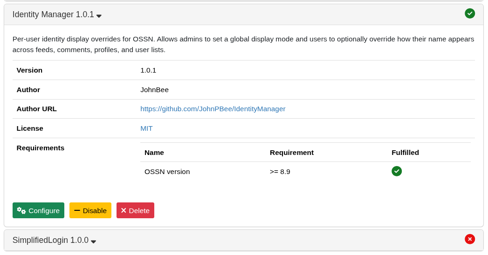
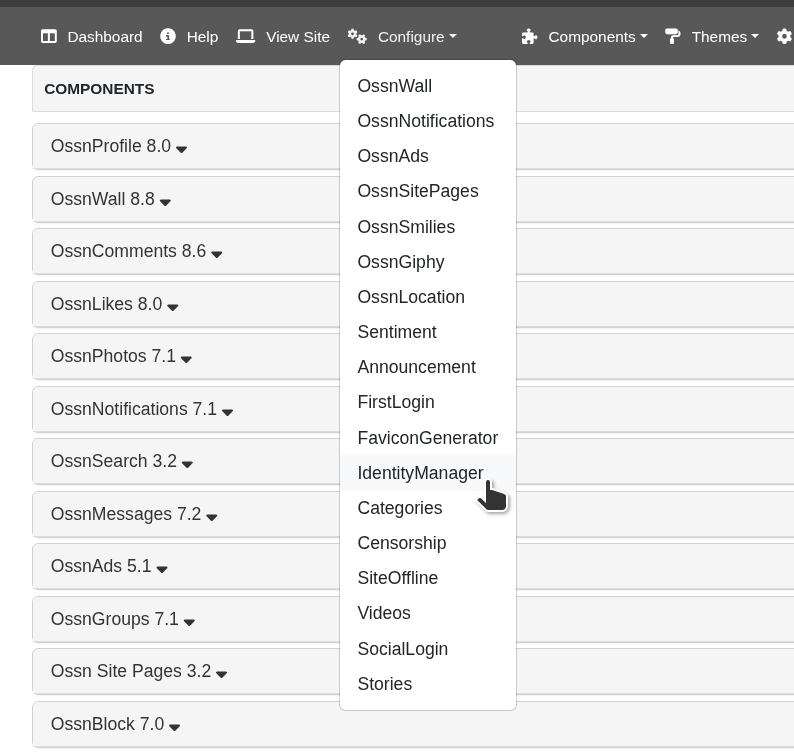
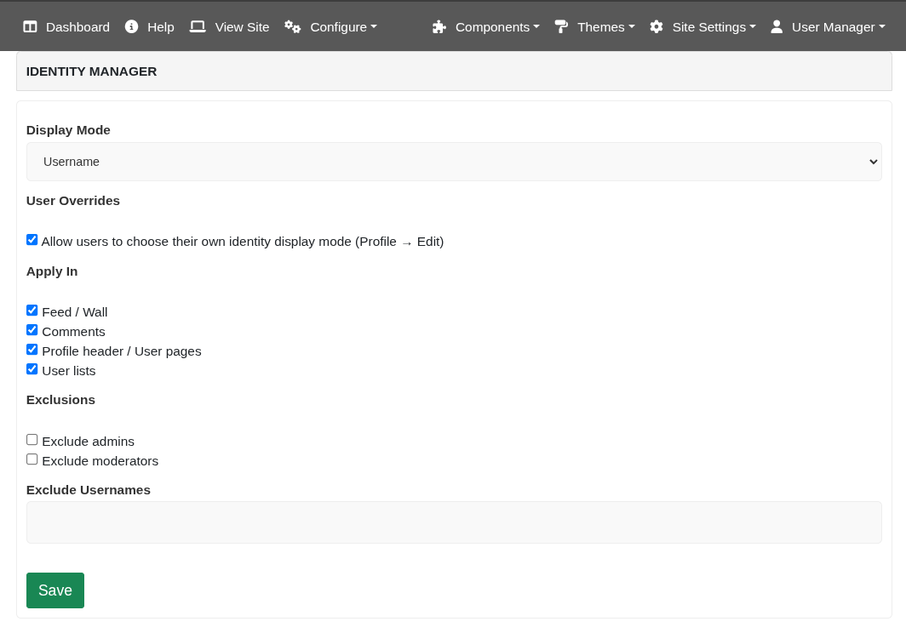
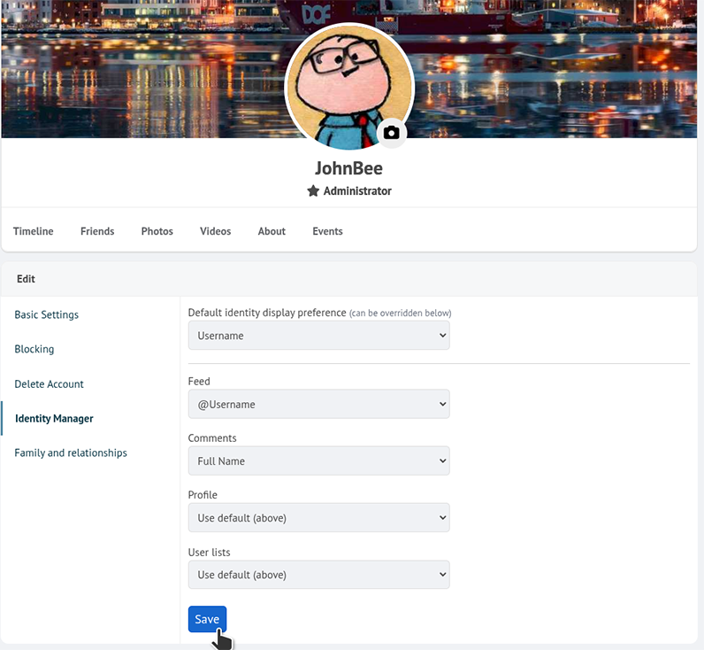

# OSSN IdentityManager (component)

Runtime-only identity display overrides for **Open Source Social Network (OSSN)**.

This component lets the admin pick a global identity display mode and (optionally) allows users to choose a default + per-context overrides for how their name is shown across the site.

## Compatibility

- Tested migration target: OSSN Premium 9.9 / PHP 8.2.
- Component metadata requires OSSN 9.9 or newer.
- The component is runtime-only: it does not change OSSN core files or create custom database tables.

## Features

- **Identity formats**
  - `full_name`
  - `username`
  - `at_username`

- **Contexts ("places")**
  - `feed`
  - `comments`
  - `profile`
  - `userlist`
  - `global` (user default)

- **Resolution order**
  1) Admin global default  
  2) If user overrides are enabled:
     - Per-context override (feed/comments/profile/userlist)
     - User default ("global")
  3) Fallback to admin default

- **Runtime-only**
  - No DB schema changes
  - No custom user fields
  - Uses OSSN hooks and annotations

- **White theme compatible**
  - Updates both `$user->fullname` and `$user->first_name` at runtime.

## Screenshots

### Component overview

### Components menu

### Admin configuration

### User identity settings

## Installation

1. Copy the component folder into:
   - `.../ossn/components/IdentityManager/`

2. In OSSN Admin panel:
   - **Components** -> enable **IdentityManager**

3. Configure:
   - **Administrator -> Identity Manager**
   - Set default mode and enable/disable user overrides.

## User settings

When enabled by admin:

- Go to: **Profile -> Edit -> Identity Manager**
- Set:
  - **Default identity display preference** (used unless overridden)
  - Optional overrides for Feed, Comments, Profile, User lists

## Storage (OSSN-native)

User preferences are stored as a single OSSN annotation:

- `type`: `identitymanager_pref`
- `owner_guid`: `<user_guid>`
- `subject_guid`: `<user_guid>`

Fields (stored on annotation data):
- `idm_mode_global`
- `idm_mode_feed`
- `idm_mode_comments`
- `idm_mode_profile`
- `idm_mode_userlist`

## Developer notes

- Main runtime mutation is done via:
  - `ossn_add_hook('user', 'get', ...)`
- Display applied by overwriting (runtime):
  - `$user->fullname`
  - `$user->first_name`
- True full name is restored via DB lookup helper when needed:
  - `jb_idm_db_fullname($guid, $fallback)`

## Troubleshooting

- If you see HTTP 500 after editing:
  - run `php -l` on component PHP files
  - check for duplicate function definitions
- If user tab doesn't appear:
  - ensure admin enabled "Allow users to choose..."
  - ensure you're logged in and using Profile -> Edit

## OSSN 9.9 notes

- Admin context checkboxes are honored by the runtime. By default, all supported contexts are enabled to preserve the original global display behavior.
- Admin exclusions are honored for admins, moderators, and comma/space-separated usernames.
- The white theme reads `first_name` in the topbar and latest-members widget, so runtime display updates both `fullname` and name parts while skipping basic profile edit/save requests.
- Comment-specific context detection depends on the current OSSN page context. Some embedded comment displays may share the feed or profile context rather than a separate `comments` context.

## License

Choose a license (MIT/Apache-2.0/GPL/etc.) and add a `LICENSE` file.
